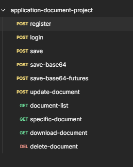

# save-document
Save user document application

This project was developed with Spring boot and Java 8.

Architecture Design:

In general, services come from the service interface through the controller. In the ServiceImpl part, it continues its operations by calling the executable that the services need to do. 
In this way, that executable service can be called to other places repeatedly.

Project General Document Operations Flow:

This application is a file management system that allows the user to save documents, retrieve these documents from the database, download, edit, and delete them. 

Dependencies List:

Postman Request List:

Some file inside of project

- application-document-project.postman_collection.json
- save-document-flow.drawio
- save-document-flow.png
- save-document-flow-architectur.png
- Lorem_ipsum.pdf
- Dummy_data.xlsx
